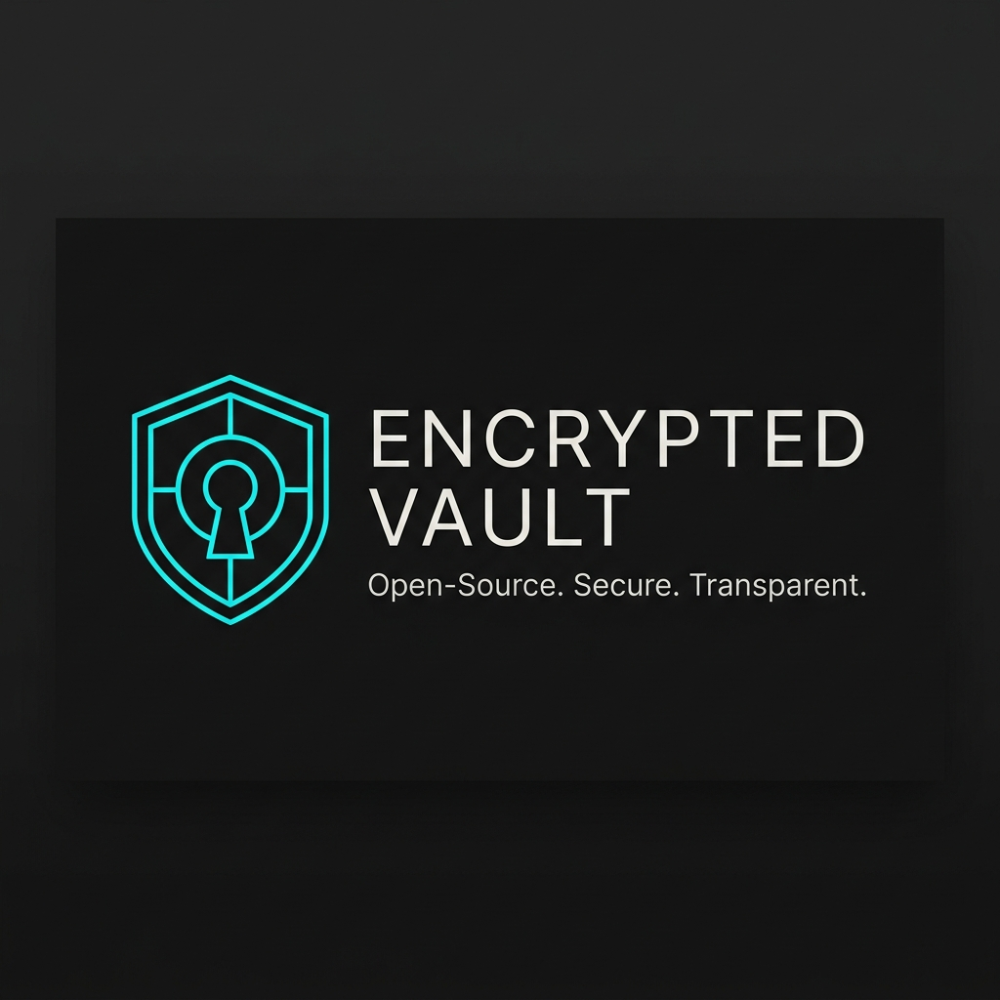
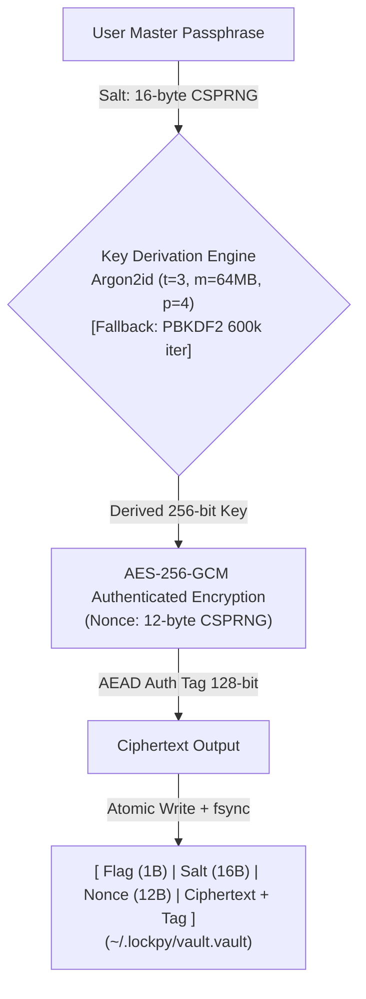
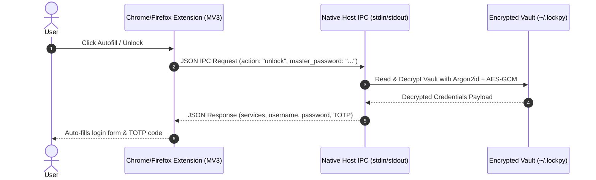

<div align="center">

  

  # 🔐 Encrypted Vault (Aegis-CLI)

  **A High-Security, Local Password Manager & 2FA Vault**

  [](https://github.com/LucasDiegoHD/Encrypted-Vault/actions)
  [](https://opensource.org/licenses/MIT)
  [](https://www.python.org/)
  [](https://github.com/PyCQA/bandit)
  [](https://github.com/psf/black)

  [Features](#-key-features) •
  [Architecture](#-cryptographic-architecture) •
  [Quick Start](#-quick-start) •
  [Browser Extension](#-browser-extension-installation--native-host-setup) •
  [CLI Commands](#-cli-command-reference) •
  [Credits](#-credits--acknowledgments)

</div>

---

## 🌟 Overview

**Encrypted Vault** is an open-source, local-first password manager engineered with modern cryptographic primitives (**Argon2id + AES-256-GCM**), RAM memory sanitation, and atomic storage guarantees. 

It provides seamless credential management across multiple interfaces: an interactive **Rich CLI**, a sleek **Electron + React Desktop Application** (with System Tray background execution & dynamic favicons), and a **Manifest V3 Chrome/Firefox Extension** connected via Native Messaging IPC.

> [!NOTE]
> **Powered by LockPy Engine**: Encrypted Vault utilizes the **LockPy** core security library (`vault.core`) for key derivation, RAM memory wiping, and secure atomic storage primitives.

---

## ✨ Key Features

| Feature | Description |
| :--- | :--- |
| 🛡️ **Local-First Architecture** | Passwords are never sent across a network. Encryption occurs locally using keys derived on demand. |
| 🔑 **Argon2id + AES-256-GCM** | State-of-the-art key derivation (Argon2id: 64MB RAM, 3 iterations) and authenticated 256-bit AES-GCM encryption. |
| 🖥️ **Sleek Dark Desktop App** | Modern graphical user interface built with Electron, React, and Tailwind CSS with System Tray background support and dynamic favicons. |
| ⚡ **Rich Terminal CLI** | Full-featured command-line interface with interactive prompts, colored tables, and quick secret access. |
| 🌐 **Browser Autofill Integration** | Native Messaging IPC Host connecting Chrome/Firefox Manifest V3 extension directly to your local vault. |
| 📲 **RFC 6238 TOTP Authenticator** | Pure Python 2FA token generator with built-in QR code scanning tool (`otpauth://`). |
| 🔗 **Ephemeral Send** | Link sharing for secrets with single-use view count and expiration timers. |
| 💾 **Encrypted Backup & Recovery** | Import/export `.lockpybk` encrypted vaults and generate 12-word BIP39 Emergency Recovery Seeds. |
| 🧹 **RAM Sanitation & Auto-Wipe** | Secrets wrapped in `SecureBuffer` RAM zero-fill containers and 15-second clipboard auto-wipe. |
| ⚡ **Atomic Storage Engine** | Write-to-temp file + `fsync` + atomic rename strategy guaranteeing vault integrity against crash/power loss. |

---

## 🏗️ Cryptographic Architecture



---

## 🌐 Browser Extension IPC Protocol



---

## 🚀 Quick Start & Installation Guide

Follow these simple steps to set up and run Encrypted Vault on your system:

### Step 1: Clone Repository & Install Python Dependencies

```bash
# 1. Clone the repository
git clone https://github.com/LucasDiegoHD/Encrypted-Vault.git
cd Encrypted-Vault

# 2. Install required Python security packages
pip install -r requirements.txt
```

> [!NOTE]
> **Default Vault File Location**: Encrypted Vault initializes its primary encrypted database file named `vault.vault` stored in `~/.lockpy/vault.vault` (inside your home directory).

---

### Step 2: Launch Desktop Application (Electron + React)

You can launch the modern Desktop Application using any of the following 3 methods:

#### ⚡ Method 1: Standalone Windows Executable (Recommended)
Simply open and run `Encrypted Vault.exe` directly from the release folder:
```
desktop/release/Encrypted Vault-win32-x64/Encrypted Vault.exe
```

#### 💻 Method 2: Python Launcher
From the repository root directory, run:
```bash
python -m vault.gui.main
```
*(This automatically launches the modern Electron + React Desktop Application)*

#### 🛠️ Method 3: NPM Development Server
```bash
cd desktop
npm start
```

---

### Step 3: Terminal CLI Usage (Optional)

```bash
# Initialize a new encrypted vault from terminal
python -m vault.cli.main init

# Add a new credential
python -m vault.cli.main add --service github.com --username octocat --url https://github.com

# Retrieve credential & copy password (clipboard auto-wipes after 15s)
python -m vault.cli.main get github.com

# Generate a 24-character secure password
python -m vault.cli.main generate --length 24 --copy
```

---

## 💻 CLI Command Reference

| Command | Usage | Description |
| :--- | :--- | :--- |
| `init` | `python -m vault.cli.main init` | Create a new encrypted vault file |
| `add` | `python -m vault.cli.main add --service <name>` | Store new credentials in the vault |
| `get` | `python -m vault.cli.main get <service>` | Decrypt & copy service password to clipboard |
| `list` | `python -m vault.cli.main list` | List all stored service domains |
| `generate` | `python -m vault.cli.main generate -l 24 -c` | Generate cryptographically secure password |
| `totp` | `python -m vault.cli.main totp <service>` | Display current 6-digit TOTP 2FA code |
| `send` | `python -m vault.cli.main send --text "secret"` | Create single-use share link |
| `backup` | `python -m vault.cli.main backup --out backup.lockpybk` | Export encrypted backup |
| `gui` | `python -m vault.cli.main gui` | Launch Graphical Desktop Application |

---

## 🌐 Browser Extension Installation & Native Host Setup

Encrypted Vault includes a **Manifest V3 browser extension** (`extension/` folder) for Chrome, Brave, Edge, and Firefox. It connects securely to your local vault via the Native Messaging Host daemon (`vault/ipc/native_host.py`) for one-click password and 2FA autofill.

### Step 1: Install the Extension in Your Browser

#### 🟦 Chrome / Chromium / Edge / Brave
1. Open your browser and navigate to `chrome://extensions` (or `edge://extensions`).
2. Enable **Developer mode** (toggle in the top right corner).
3. Click **Load unpacked** (*Carregar sem compactação*).
4. Select the **`extension`** folder inside this repository.
5. Copy the generated **Extension ID** (e.g. `knkjbchdflkbae...`).

#### 🦊 Mozilla Firefox
1. Navigate to `about:debugging#/runtime/this-firefox`.
2. Click **Load Temporary Add-on...** (*Carregar extensão temporária*).
3. Select the `extension/manifest.json` file.

---

### Step 2: Register the Native Host Bridge (IPC Daemon)

#### 🪟 Windows (Automatic Setup)
Simply run the registration script from the repository root:
```cmd
register_extension.bat
```
*This registers the `com.lockpy.vault` host manifest into the Windows Registry under `HKCU\Software\Google\Chrome\NativeMessagingHosts`.*

#### 🐧 Linux & 🍎 macOS (Manual Setup)
Refer to the complete step-by-step registration guide in **[docs/NATIVE_MESSAGING.md](docs/NATIVE_MESSAGING.md)**.

---

## 🎯 Threat Model & Security Guarantees

For complete disclosure policy and vulnerability reports, please refer to **[.github/SECURITY.md](.github/SECURITY.md)**.

| Threat / Risk | Status | Mitigation Strategy |
| :--- | :---: | :--- |
| **Physical Disk Theft / Stolen Device** | 🛡️ Protected | Vault database (`vault.vault`) is encrypted with **Argon2id + AES-256-GCM**. Data cannot be read without the Master Password. |
| **Man-in-the-Middle (MITM) Network Interception** | 🛡️ Protected | Local-first architecture. No vault secrets ever traverse network adapters or external servers. |
| **Process Memory Dump** | 🛡️ Protected | Secrets loaded into RAM use `SecureBuffer` containers with zero-fill memory wiping on garbage collection (`memory.py`). |
| **Clipboard History Snooping** | 🛡️ Protected | Background thread automatically purges passwords copied from CLI after 15 seconds. |
| **Power Loss / Disk Corruption** | 🛡️ Protected | Atomic write strategy (`atomic_write`) flushes temporary files to disk with `os.fsync` before swapping target file. |
| **Infected Host with Kernel Keylogger** | ⚠️ Out of Scope | If the OS kernel or memory space is fully compromised by malware with root privileges, host isolation cannot be guaranteed. |

---

## 🧪 Testing & Security Auditing

Encrypted Vault includes an extensive test suite and automated static security analysis (SAST):

```bash
# Run unit tests with coverage report
python -m pytest --cov=vault tests/

# Run Bandit SAST security audit
bandit -r vault/

# Check code formatting & style
black --check vault/ tests/
flake8 vault/ tests/
```

---

## 📁 Repository Structure

```
encrypted-vault/
├── assets/                       # GitHub Header Banner & Screenshots
├── desktop/                      # Modern Electron + React Desktop App & .exe Build
├── docs/                         # System Architecture & Native Host IPC Setup Guides
├── extension/                    # Manifest V3 Chrome/Firefox Extension
├── vault/                        # Main Python Core Security Engine & CLI
│   ├── core/                     # Crypto, Storage, Memory, TOTP, Send, Backup (LockPy Engine)
│   ├── cli/                      # Rich Terminal CLI Interface
│   ├── gui/                      # CustomTkinter & Desktop Launchers
│   ├── ipc/                      # Native Messaging Host Daemon
│   └── tools/                    # QR Scanner & Helpers
├── tests/                        # Pytest Test Suite
├── .github/                      # CI/CD Workflows & Security Policies
├── register_extension.bat        # Windows Native Host Registrar
├── requirements.txt              # Dependencies
└── README.md                     # Documentation
```

---

## 🤝 Credits & Acknowledgments

**Encrypted Vault** is powered by the **LockPy** core security engine (`vault.core`), which provides key derivation (Argon2id), authenticated encryption (AES-256-GCM), RAM memory protection (`SecureBuffer`), atomic storage guarantees, and pure Python RFC 6238 TOTP authentication. 

Special credits and acknowledgments to the **LockPy** core library.

---

## 📄 License & Disclaimer

Distributed under the **MIT License**. See [`LICENSE`](LICENSE) for details.

> [!WARNING]
> **Security Disclaimer**: Encrypted Vault implements local encryption. Store your Master Password securely. If lost, your encrypted data cannot be decrypted or recovered.
